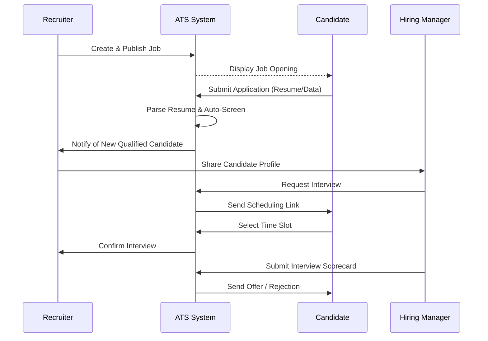
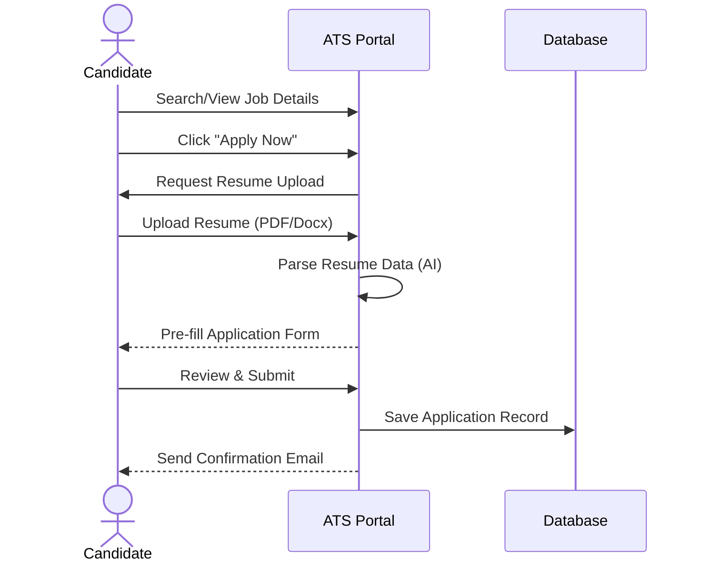
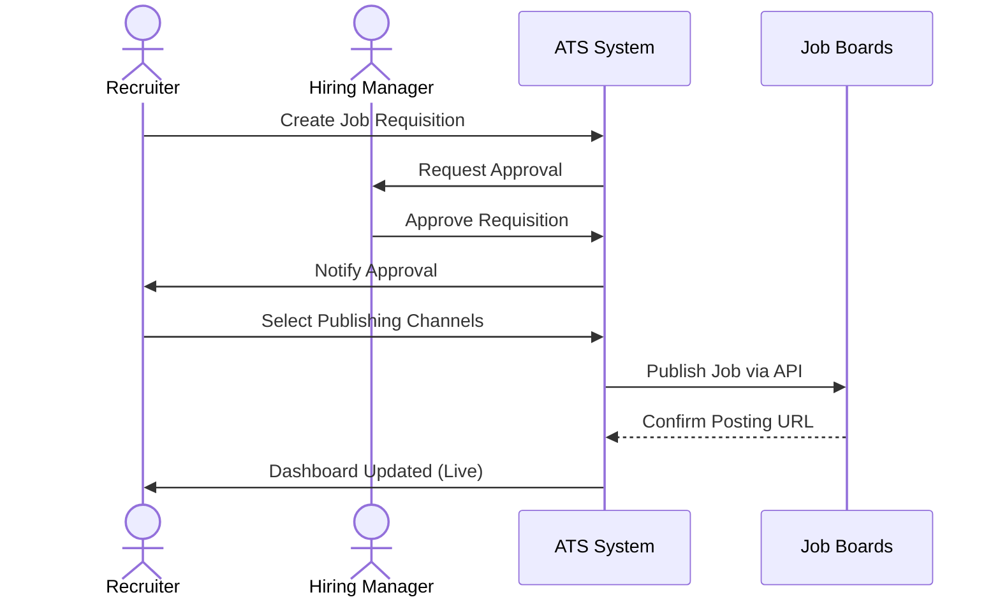
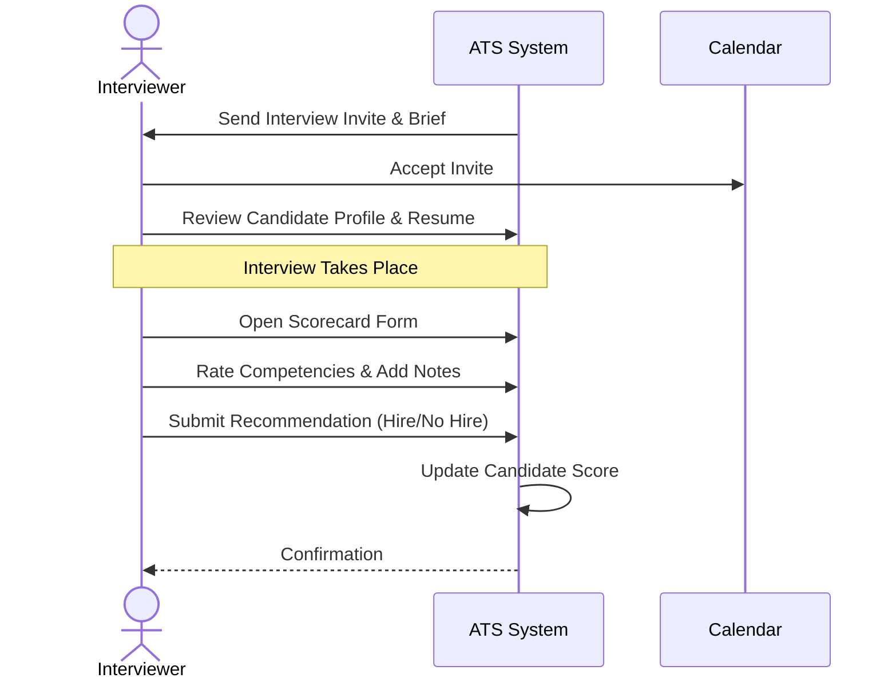
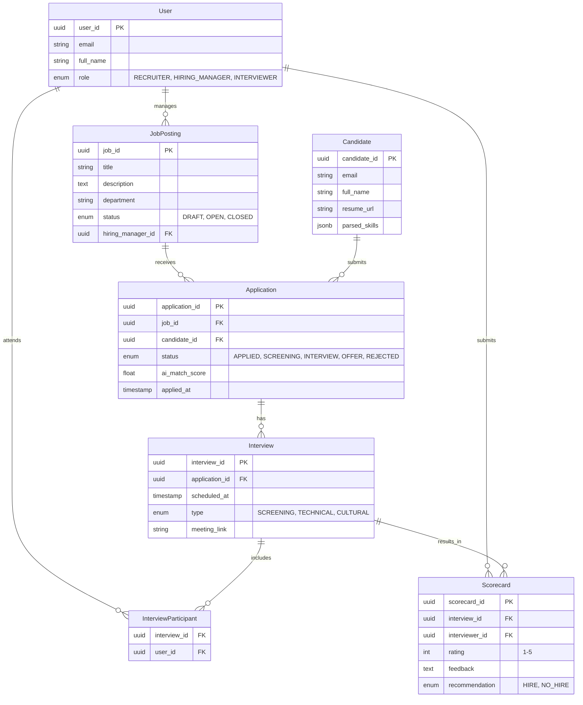
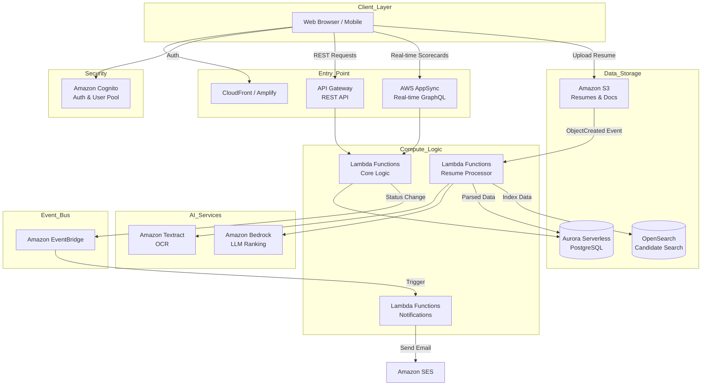
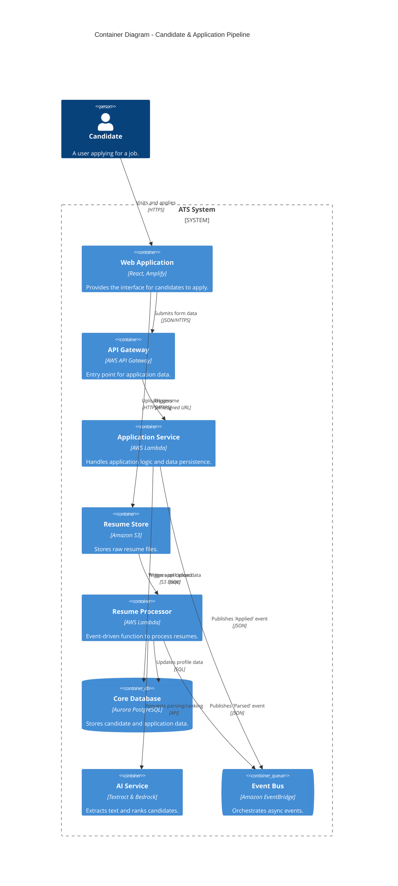

# 🚀 ATS Business Logic Overview

## 1. How an ATS Works

An **Applicant Tracking System (ATS)** is a software application that streamlines the recruitment process by automating job postings, resume screening, and interview scheduling. It serves as a central repository for candidate data, enabling HR teams to track applicants through various stages of the hiring pipeline—from application to offer—while facilitating collaboration among hiring managers.

## 2. Main Functionalities

The following table outlines core functionalities. Features marked with a star (⭐) represent high-value areas for **automation, real-time collaboration, and AI assistance** to maximize efficiency.

| Functionality | Description | Efficiency Potential (⭐) |
| :--- | :--- | :---: |
| **Smart Resume Parsing** | Automatically extracting contact info, skills, and experience from CVs to populate profiles. | ⭐ |
| **AI-Driven Candidate Ranking** | Using AI to score and rank candidates based on job description relevance. | ⭐ |
| **Multi-Channel Job Posting** | One-click distribution of job openings to LinkedIn, Indeed, Glassdoor, etc. | ⭐ |
| **Automated Interview Scheduling** | Calendar integration allowing candidates to self-select available slots, reducing email tag. | ⭐ |
| **Collaborative Scorecards** | Real-time shared feedback forms for interviewers to rate candidates immediately. | ⭐ |
| **Automated Communication Workflows** | Trigger-based emails for application receipt, status updates, and rejections. | ⭐ |
| **Talent Pool CRM** | Searchable database of past applicants for future roles. | |
| **Diversity & Inclusion Analytics** | AI analysis of job descriptions and pipelines to ensure bias-free hiring. | ⭐ |
| **Offer Management** | Digital offer letter generation and e-signature integration. | |
| **Referral Portal** | Interface for employees to submit and track referrals. | |

## 3. Market Solutions Comparison

| Solution | Strengths | Weaknesses |
| :--- | :--- | :--- |
| **Greenhouse** | Industry standard for structured hiring; excellent reporting and DE&I tools; vast integration ecosystem. | Can be expensive for smaller startups; steep learning curve; UI can feel dense. |
| **Lever** | Strong CRM capabilities for sourcing passive candidates; intuitive and clean UI; great email integration. | Reporting is less granular than Greenhouse; can struggle with very high-volume hiring complexities. |
| **Workday** | Seamless integration with HRIS/Payroll (all-in-one); enterprise-grade security and compliance. | Clunky, outdated user experience; slow implementation; very expensive; not specialized for recruiting. |
| **Ashby** | Modern, fast UI; powerful custom analytics; combines ATS and CRM effectively; high automation capabilities. | Newer player with fewer legacy integrations; mobile experience is still maturing. |

## 4. Roadmap: Building the Next-Gen ATS

This roadmap focuses on the high-efficiency (⭐) features to build a competitive, automated, and intelligent system.

### **Phase 1: The Intelligent Core (Months 1-3)**

* **Goal:** Establish the data foundation and AI processing capabilities.
* **Features:**
  * Core Database & Candidate Profiles.
  * **Smart Resume Parsing (AI)**: Implement NLP to structure unstructured resume data.
  * **AI-Driven Candidate Ranking**: Develop matching algorithms to highlight top talent instantly.

### **Phase 2: Automation & Velocity (Months 4-6)**

* **Goal:** Remove manual administrative bottlenecks.
* **Features:**
  * **Automated Interview Scheduling**: Two-way calendar sync and self-scheduling portal.
  * **Multi-Channel Job Posting**: API integrations with major job boards.
  * **Automated Communication Workflows**: Set up state-change triggers for candidate emails.

### **Phase 3: Collaboration & Insights (Months 7-9)**

* **Goal:** Enhance team decision-making and process optimization.
* **Features:**
  * **Collaborative Scorecards**: Real-time syncing of interviewer feedback.
  * **Diversity & Inclusion Analytics**: Dashboards to monitor pipeline health and bias.
  * **AI Copilot for Recruiters**: Chat interface to query candidate data ("Show me Python devs in London").

## 5. Lean Canvas: ATS Business Logic

| | | | | |
| :--- | :--- | :--- | :--- | :--- |
| **PROBLEM** 1. Hiring takes too long (Time-to-Hire). 2. Good candidates are lost in black holes. 3. Scheduling interviews is a logistical nightmare. 4. Bias in screening processes. | **SOLUTION** 1. AI-powered screening to surface top talent fast. 2. Automated scheduling and communication loops. 3. Collaborative, structured hiring workflows. 4. Centralized candidate data. | **UNIQUE VALUE PROPOSITION** "The first ATS that works for you, not against you."  An AI-native platform that automates 80% of admin work, allowing recruiters to focus on people, not spreadsheets. | **UNFAIR ADVANTAGE** 1. Proprietary matching algorithm. 2. Deep integration with developer tools (GitHub/StackOverflow) for tech hiring. 3. User-centric design (consumer-grade UX). | **CUSTOMER SEGMENTS** 1. High-growth Tech Startups (Series A-C). 2. Mid-market enterprises modernizing HR. 3. Recruitment Agencies.  **Early Adopters:** Tech companies with remote-first hiring needs. |
| **EXISTING ALTERNATIVES** 1. Excel / Email (Manual). 2. Legacy Enterprise ATS (Workday, Taleo). 3. Modern ATS (Greenhouse, Lever). | **KEY METRICS** 1. Time-to-Hire (Days). 2. Candidate Net Promoter Score (cNPS). 3. Interview-to-Offer Ratio. 4. Admin hours saved per hire. | **CHANNELS** 1. Direct Sales / Demo requests. 2. Content Marketing (Hiring best practices). 3. Partnerships with HR consultancies. 4. Product-Led Growth (Free tier for small teams). | | |
| **COST STRUCTURE** 1. Cloud Infrastructure (AWS/Azure). 2. AI Model Training & API Costs. 3. Software Development Team. 4. Sales & Customer Success. | **REVENUE STREAMS** 1. SaaS Subscription (Per user or Per employee). 2. Enterprise Customization Fees. 3. Add-on features (Premium Job Board distribution). | | | |

## 6. Core Use Cases

### Use Case 1: Candidate Application Journey 📝
**Description:** The end-to-end process for a candidate to discover a job opening, submit their application, and receive confirmation. This is the "front door" of the ATS.

**Key Actors:**
*   **Candidate:** The job seeker.
*   **ATS System:** The platform handling the data.

**Success Metrics:**
*   **Application Completion Rate:** % of users who start and finish the application.
*   **Time-to-Apply:** Average time taken to complete the form (Target: < 5 mins).

**Risks:**
*   **High Drop-off Rate:** If the form is too long or requires account creation.
*   **Parsing Errors:** Resume parser failing to read non-standard formats.

### Use Case 2: Job Creation & Publishing 📢
**Description:** The workflow for a recruiter or hiring manager to define a new role, get internal approval, and distribute it to external job boards.

**Key Actors:**
*   **Job Poster (Recruiter):** Initiates the process.
*   **Hiring Manager:** Approves the requisition.
*   **External Job Boards:** LinkedIn, Indeed, etc.

**Success Metrics:**
*   **Time-to-Publish:** Time from draft to live.
*   **Channel Reach:** Number of views/applications per channel.

**Risks:**
*   **Approval Bottlenecks:** Delays in internal sign-off.
*   **Integration Failures:** API errors preventing posting to external sites.

### Use Case 3: Candidate Evaluation & Feedback ⚖️
**Description:** The process where an interviewer conducts the assessment and submits structured feedback to inform the hiring decision.

**Key Actors:**
*   **Interviewer:** Subject matter expert conducting the interview.
*   **Recruiter:** Coordinator of the process.

**Success Metrics:**
*   **Scorecard Submission Time:** Time between interview end and feedback submission (Target: < 24 hrs).
*   **Interviewer Calibration:** Consistency in scoring across different interviewers.

**Risks:**
*   **Unconscious Bias:** Subjective feedback affecting fairness.
*   **Delayed Feedback:** Slowing down the decision process, risking candidate loss.

## 7. Data Model 💾

This section outlines the core database schema required to support the ATS functionalities, focusing on the relationships between candidates, jobs, and the hiring workflow.

### **Entity Relationship Diagram (ERD)**

### **Entity Descriptions**

1.  **User**: Represents all internal system users.
    *   **Role**: Determines permissions (e.g., only Hiring Managers can approve Job Postings).
    *   **Relationships**: Can be a Hiring Manager for a Job, an Interviewer in an Interview, or the author of a Scorecard.

2.  **JobPosting**: A specific role opening.
    *   **Status**: Tracks the lifecycle of the opening (Draft -> Open -> Closed).
    *   **Hiring Manager**: The primary stakeholder responsible for the role.

3.  **Candidate**: The external applicant.
    *   **Parsed Skills**: JSON field storing skills extracted by AI from the resume for matching algorithms.
    *   **Resume URL**: Link to the stored document (e.g., S3 bucket).

4.  **Application**: The central entity linking a Candidate to a Job.
    *   **Status**: The most critical field, driving the Kanban board view (e.g., "Moved to Interview").
    *   **AI Match Score**: A calculated value (0-100) indicating fit, populated upon application submission.

5.  **Interview**: A scheduled event within an application process.
    *   **Type**: Distinguishes between phone screens, coding challenges, etc.
    *   **Participants**: Handled via a junction table (`InterviewParticipant`) to allow multiple interviewers (panel interviews).

6.  **Scorecard**: The structured feedback form.
    *   **Rating & Recommendation**: Quantitative data for reporting and decision support.
    *   **Link**: Directly tied to a specific Interview instance to track who said what and when.

## 8. System Architecture & Design 🏗️

### **Recommended Pattern: Event-Driven Serverless Architecture**

Based on the requirements for **AI processing** (resume parsing), **real-time collaboration** (scorecards), and **variable traffic loads** (job postings), an **Event-Driven Serverless** architecture is the most suitable choice.

**Why this choice?**
*   **Decoupling:** Heavy AI tasks (parsing resumes) won't block the user interface or the core API.
*   **Scalability:** Serverless functions (Lambda) scale automatically to handle bursts of applications without provisioning idle servers.
*   **Cost Efficiency:** You only pay for compute when code is running, which is ideal for an ATS where traffic fluctuates.

| Pros | Cons | Decision Rationale |
| :--- | :--- | :--- |
| **High Scalability:** Handles 1 or 10,000 applicants seamlessly. | **Cold Starts:** Slight latency for infrequently used functions. | Critical for "viral" job postings. |
| **Operational Simplicity:** No server patching or OS management. | **Vendor Lock-in:** Heavily tied to AWS ecosystem. | Accepted trade-off for development speed. |
| **Event Integration:** Native support for triggering AI workflows from file uploads. | **Debugging Complexity:** Distributed tracing can be harder. | Mitigated using AWS X-Ray. |

### **High-Level AWS System Design**

The system is composed of three main layers: **Frontend (Client)**, **Backend (API & Logic)**, and **Data/AI Layer**.

1.  **Frontend (SPA)**
    *   **Hosting:** **AWS Amplify** (or S3 + CloudFront) for hosting the React/Next.js application.
    *   **Authentication:** **Amazon Cognito** for user management (Recruiters, Candidates) and JWT token generation.

2.  **Backend (API & Compute)**
    *   **API Gateway:** Entry point for all RESTful requests.
    *   **AWS Lambda:** Serverless compute for business logic (CRUD operations, status updates).
    *   **AWS AppSync (GraphQL):** Used specifically for **Real-Time Collaboration** on Scorecards, allowing interviewers to see updates instantly.

3.  **Asynchronous & AI Workflows**
    *   **Amazon EventBridge:** The central event bus. When a candidate applies, an event is published to trigger downstream processes (emails, indexing).
    *   **Amazon S3:** Stores raw resume files (PDF/Docx).
    *   **Amazon Textract / Bedrock:** Triggered via S3 upload events to extract text and generate summaries/rankings using LLMs.

4.  **Data Layer**
    *   **Amazon Aurora Serverless v2 (PostgreSQL):** The primary relational database for the Core Data Model (Jobs, Applications, Users).
    *   **Amazon OpenSearch Service:** For high-performance full-text search on candidate profiles and resumes.

### **Architecture Diagram**

## 9. C4 Container Diagram 🧩

This diagram details the **Candidate & Application Pipeline**, illustrating how the containers interact when a candidate submits an application and uploads a resume.

